# Case Study
We are setting up a simple registration system for our event scheduled for mm-dd-yyyy. The objective is to create a clean, user-friendly form that collects the following information from attendees:
```
Full Name | Email Address | Phone Number | Company | Position or Role | Event they wish to attend | Preferred Session | Number of Tickets Required | How they Heard About Us
```

**Expected Workflow**
Once a participant submits the form, the system should automatically:
- Send a personalized confirmation email to the attendee.
- Add the participant’s details to the attendee list for record keeping.
- Schedule reminder emails as the event date approaches.
- The entire process should operate seamlessly without manual follow-ups.

**Important Condition**

If a participant selects “Other” in the “How did you hear about us?” field, they must not receive confirmation emails or reminder messages. This aligns with the company’s policy of excluding participants who did not learn about the event through the approved channels.

**Additional Automation**

One hour after the reminder email has been sent, the system should automatically send an update to the Slack team for each event session. 
The update should include the list of participants registered for that specific event time.

# Project Overview

Event registration and participant communication were previously handled manually, resulting in delayed confirmation emails, inconsistent reminder scheduling, and limited visibility for event teams managing attendee lists.

To address these challenges, I designed and implemented an automated event registration pipeline using Google Forms, Google Sheets, Zapier, Gmail, and Slack.

The system automatically:

- Collects and formats participant data

- Sends personalized confirmation and reminder emails

- Enforces marketing policy filters to exclude unapproved channels

- Provides real-time attendee updates to internal event teams

Once a participant submits the registration form, the automation processes the data, schedules the appropriate communications, and distributes participant information to the relevant event team without manual intervention.

The objective of this system is to create a reliable, scalable, and organized event registration workflow for events scheduled for mm-dd-yyyy, while ensuring a smooth experience for both participants and event organizers.

## Data Collection

A Google Form was used to collect participant registration information.

The form captures the following fields:

```
Full Name | Email Address | Phone Number | Company | Position or Role | Event they wish to attend | Preferred Session | Number of Tickets Required | How they heard about us
````

This form acts as the entry point for the entire automation workflow.

## Workflow Design and Planning

Before implementing the automation, a visual flowchart of the system architecture was created using Miro.<br>

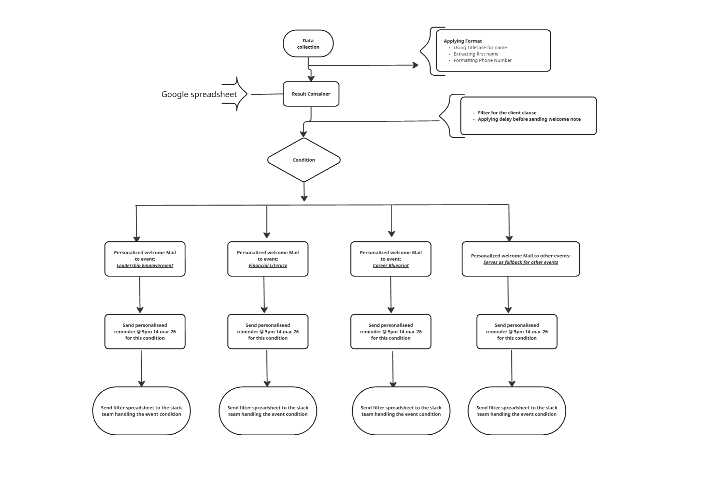 <br>

This diagram helped map the complete process including:
- Data collection
- Data formatting
- Conditional filtering
- Event-specific email communication
- Reminder scheduling
- Internal notifications

The visual planning ensured the workflow was logically structured and scalable before implementation in Zapier.

## Registration Form Creation and Data Processing

The first operational step in the automation pipeline was the creation of the event registration form using Google Forms. This form serves as the primary interface for participants to register for the event, and it feeds structured data directly into the automation workflow.

**Form Creation Using Google Forms**

A Google Form was designed to be simple, intuitive, and easy to complete in order to minimize friction during registration. Each field was carefully configured to ensure the data collected would be compatible with the downstream automation steps.

The following fields were created in the form:

| Field | Type | Purpose |
|------|------|------|
| Full Name | Short answer | Captures the participant’s full name for identification and personalization |
| Email Address | Short answer | Used to send confirmation and reminder emails |
| Phone Number | Short answer | Allows organizers to contact participants if necessary |
| Company | Short answer | Captures the organization the participant represents |
| Position or Role | Short answer | Helps understand the professional background of participants |
| Event they wish to attend | Dropdown | Determines which automation path the participant follows |
| Preferred Session | Dropdown | Indicates the session time the participant prefers |
| Number of Tickets Required | dropdown | Helps estimate attendance and capacity |
| How did you hear about us? | Multiple Choice | Used to enforce the company’s marketing policy filter |

The `Event they wish to attend` field plays a critical role because it determines which conditional automation path the participant will follow later in the Zapier workflow.

Similarly, the `How did you hear about us?` field is used to enforce the organization's policy regarding participant eligibility for automated communication.

Once the form structure was finalized, Google Forms automatically generated a linked response sheet in Google Sheets, which serves as the primary data source for the automation.

## Data Processing and Formatting
The automation is triggered when a new Google Forms response is recorded in Google Sheets. Zapier then performs a sequence of processing steps using Formatter by Zapier, including data formatting, conditional filtering, event-based routing using Paths, and scheduled actions using Delay Until.

After form submission, the raw data captured by Google Forms is passed to Zapier, where Formatter actions are used to clean, standardize, and structure the data before it is used in automated communication and notification steps.

The following transformations are applied:

**Name Formatting**

- Convert the participant's full name into Title Case to maintain a consistent format.

Example:

```
Input:
john doe
```

```
Processed Output:
John Doe
```
```
First Name extracted:
John
```

**Phone Number Standardization**

The phone number is formatted into a consistent standard format to improve readability and ensure compatibility with potential communication systems.

Example format:
```
Input:
08081234567
```

```
Output:
2348081234567
```
These processing steps ensure that participant data is clean, structured, and suitable for automated communication, enabling the rest of the workflow to operate reliably.

## Policy-Based Filtering

A key business rule was implemented during the automation process.

Company Policy
```
If a participant selects “Other” in the field:

“How did you hear about us?”
```
then the system does not send confirmation emails or reminder messages to that participant.

This condition ensures that the organization only engages with participants acquired through approved marketing channels.

Zapier filters automatically enforce this rule before any communication is sent.

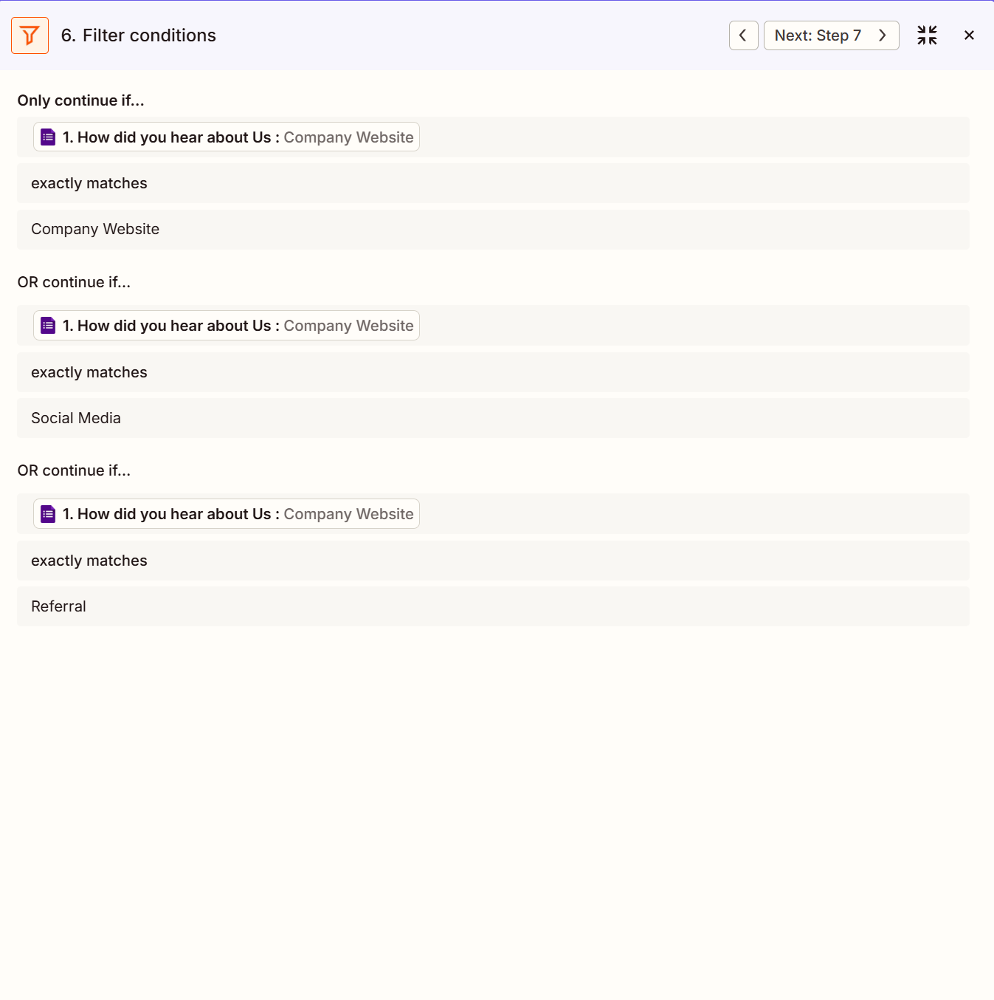

## Event-Based Conditional Routing

After filtering, the workflow splits into four conditional paths depending on the event selected by the participant.

These paths allow the system to send event-specific welcome emails and notifications.

Event Paths: <br>

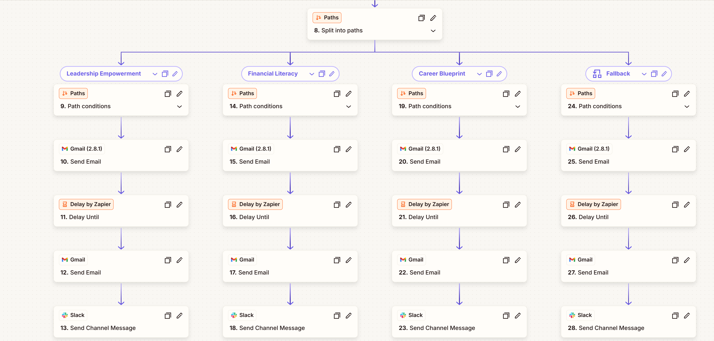

- Leadership Empowerment

- Financial Literacy

- Career Blueprint

- Fallback (used for other events)

## Personalized Confirmation Emails Samples

- **The Major Groups**

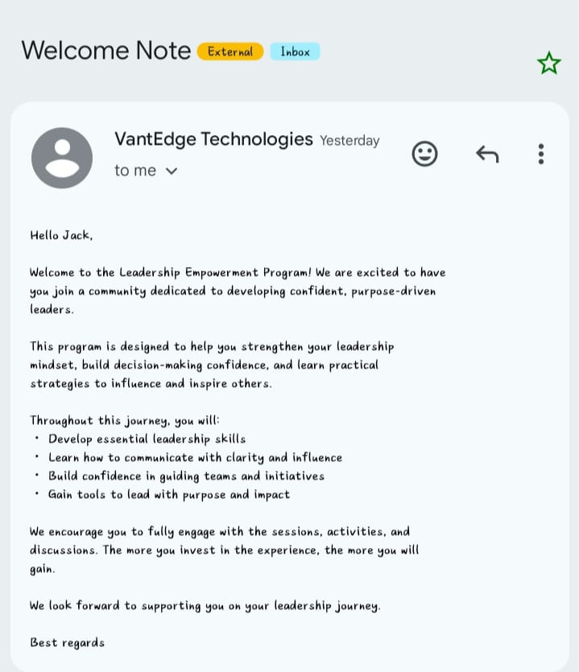      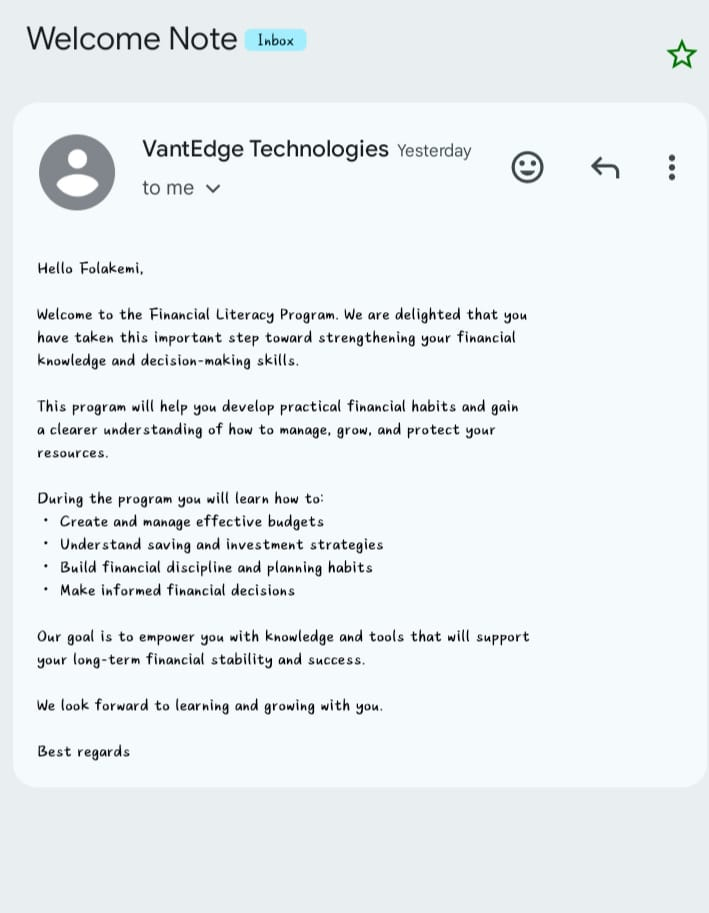

- **The Fallback Group**<br>
Participants who register for events outside the three main categories receive a general welcome email.


## Reminder Scheduling and Time Control in Zapier

To ensure participants receive reminders at a specified time before the event, the automation workflow uses Zapier’s 'Delay Until' action to schedule reminder emails and internal notifications.

This step allows the workflow to pause execution until a specified date and time before continuing to the next actions.

**Delay Configuration**

The reminder schedule was configured using the Delay Until feature in Zapier. This step pauses the automation until the defined timestamp:
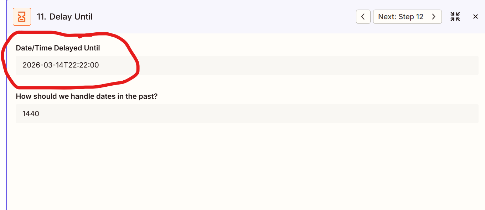

```
2026-03-14T22:22:00
```

**Slack Team Notification Timing**

Immediately after the reminder email is sent, the automation proceeds to notify the internal event management team via Slack.

##  Automated Reminder System

To ensure strong event attendance, reminder emails are scheduled automatically.

Participants receive a reminder message  at the set time ```2026-03-14T22:22:00``` as highlighted in the reminder mail screenshot below. <br>

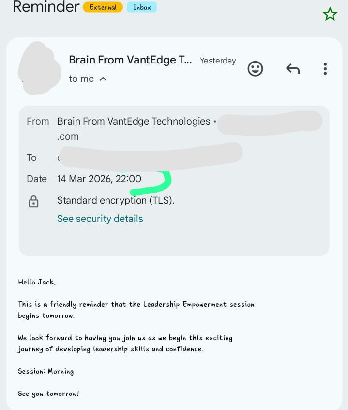  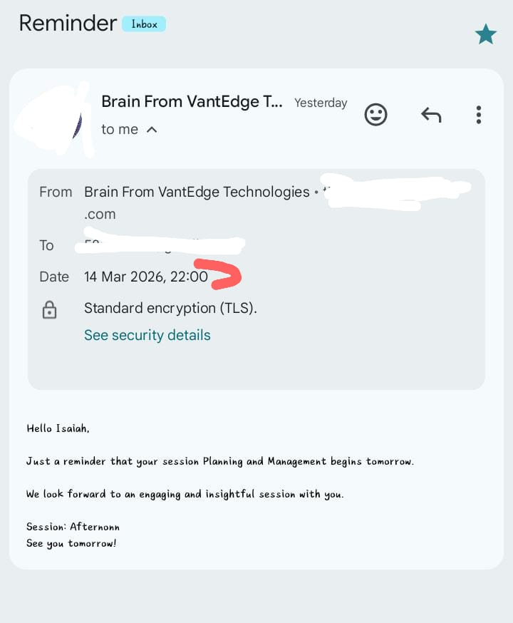  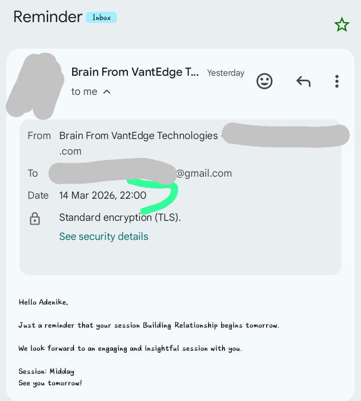

## Internal Team Notification
Once participant emails and reminders are scheduled, the final automation step sends participant information to the appropriate internal team via Slack. <br>
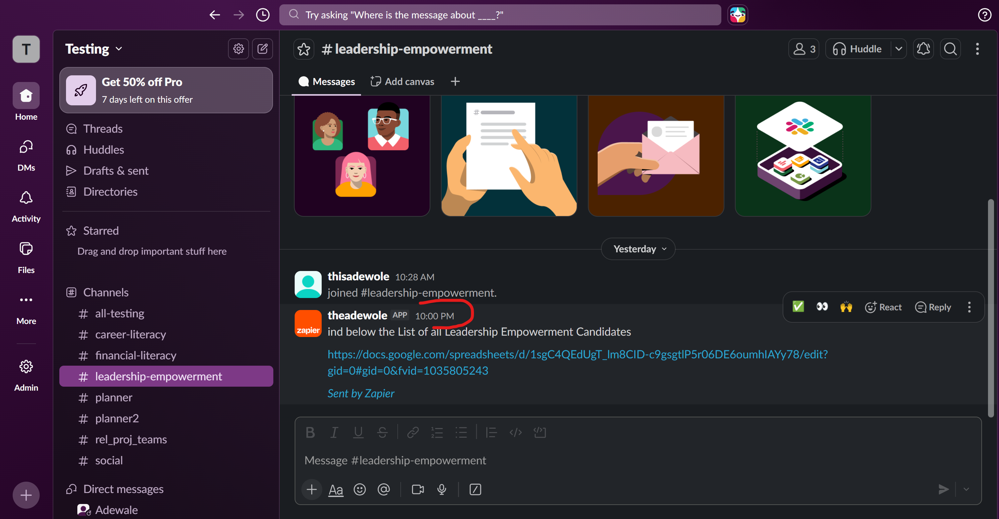  
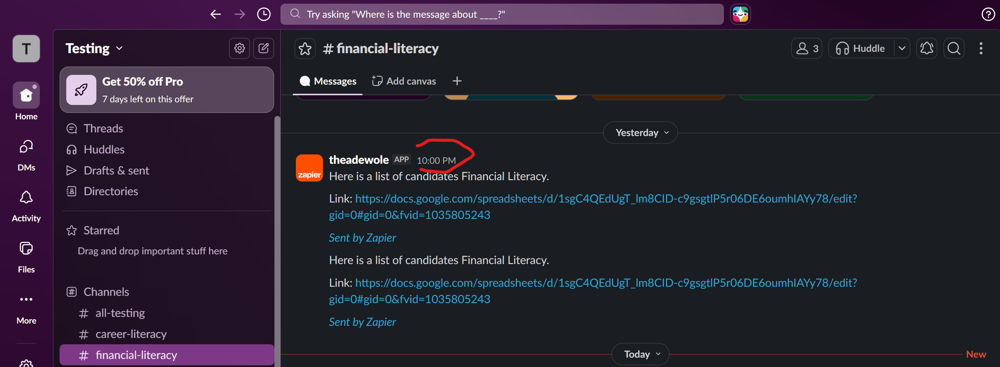  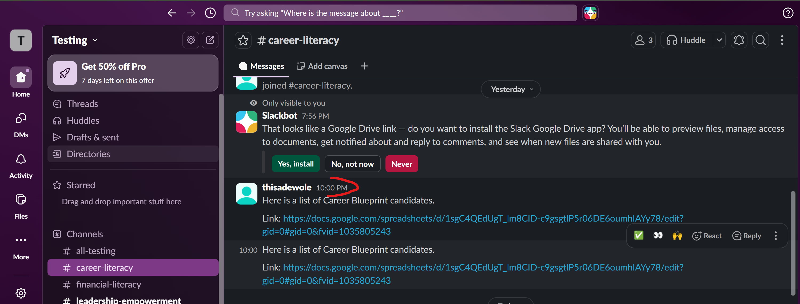

Each event team receives a filtered spreadsheet containing the participants registered for their event.

This enables teams to:

- Monitor registration numbers
- Prepare event materials
- Coordinate participant engagement
- Manage event logistics effectively


# Automation Architecture Summary

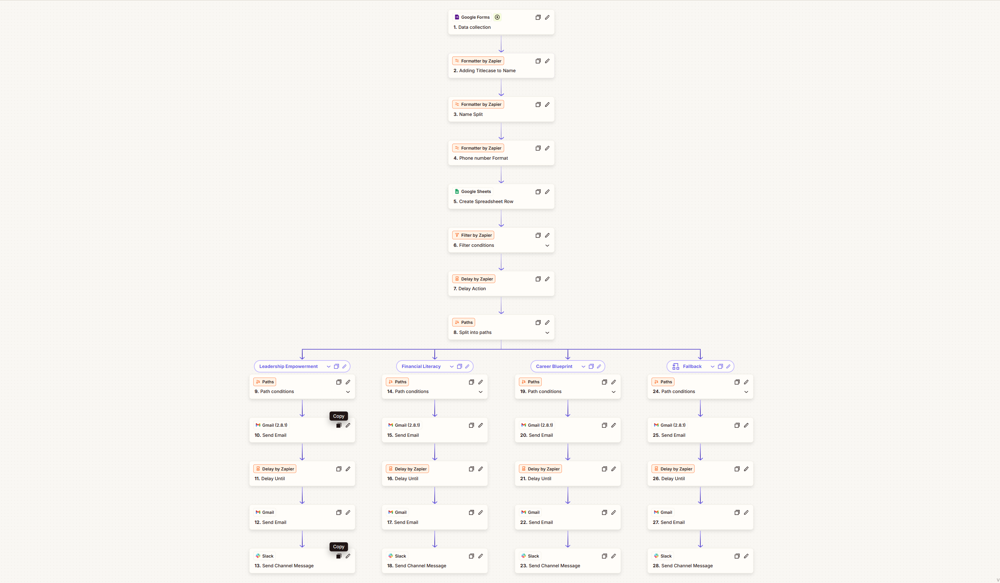 

The entire automation pipeline follows this sequence:

- Participant submits Google Form

- Data is formatted and cleaned using Zapier Formatter

- Data is stored in Google Sheets

- Zapier filter checks company policy conditions

- Workflow splits into event-specific paths

- Personalized confirmation emails are sent

- Reminder emails are scheduled

- Event teams receive participant records via Slack

This system removes manual work and ensures consistent participant communication and organized event management.

# Tools and Platforms

- **Google Forms** — Data collection

- **Google Sheets** — Participant database

- **Zapier** — Workflow orchestration

- **Gmail** — Automated email communication

- **Slack** — Internal notifications

- **Miro** — Workflow architecture design
